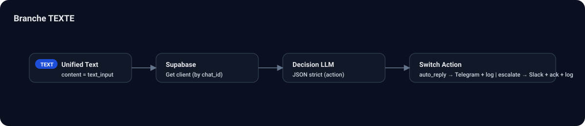
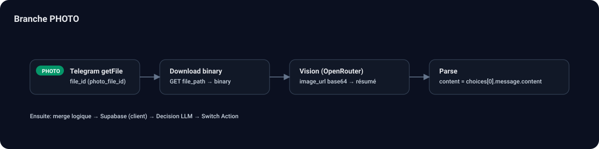
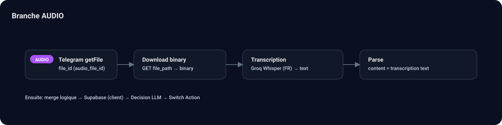
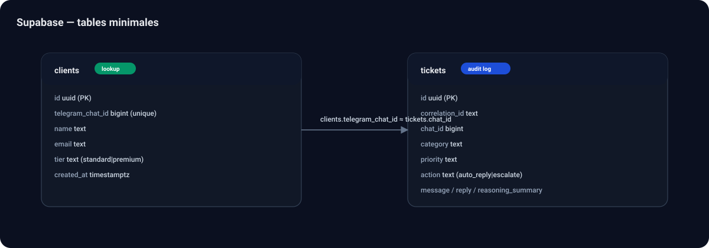

# 🤖 Gestion des litiges — Workflow n8n de support client (multimodal)

Workflow **n8n** orienté “production” pour traiter automatiquement des requêtes support/litiges reçues sur **Telegram** (texte / photo / audio), enrichir le contexte client (Supabase), puis décider d’une action (**réponse automatique** ou **escalade**) via un LLM.

## Ce que ce projet démontre (recrutement)

- Orchestration n8n (routing, branches multimodales, merge, actions)
- Intégration APIs (Telegram, Groq/OpenAI-compatible, OpenRouter, Supabase)
- Traitement multimodal (Vision + transcription)
- Conception d’un routeur IA (prompting, JSON strict, fallback robuste)
- Logging / audit (tickets) et escalade (Slack / Gmail optionnels)

## Architecture (résumé)

```mermaid
flowchart LR
	T[Telegram Trigger] --> N[Normalize Input]
	N --> S1{Switch Type}
	S1 -->|text| TXT[Set Unified Text]
	S1 -->|photo| P1[Telegram getFile] --> P2[Download] --> V[Vision (OpenRouter)] --> VP[Parse]
	S1 -->|audio| A1[Telegram getFile] --> A2[Download] --> TR[Transcription (Groq Whisper)] --> AP[Parse]
	TXT --> DB[Supabase: Get client]
	VP --> DB
	AP --> DB
	DB --> C[Build Context] --> LLM[Decision LLM (Groq)] --> PD[Parse Decision JSON]
	PD --> S2{Switch Action}
	S2 -->|auto_reply| R1[Telegram reply] --> LOG1[Supabase: ticket log]
	S2 -->|escalate| SL[Slack alert] --> ACK[Telegram ack] --> LOG2[Supabase: ticket log]
```

## Fichiers importants

- n8n/workflows/workflow.json : définition du workflow (sans secrets; utilise des variables d’environnement)
- docs/workflow-setup.md : guide “pas à pas” des nœuds + configuration
- docs/supabase-schema.sql : schéma SQL minimal (`clients`, `tickets`)
- docs/screenshots/ : captures d’écran à déposer pour la vitrine GitHub

## Démarrage rapide

1. Importer le workflow : dans n8n → **Import workflow** → importer le fichier n8n/workflows/workflow.json
2. Renseigner les variables : partir de .env.example (ou credentials n8n)
3. Créer les tables Supabase : exécuter docs/supabase-schema.sql
4. Activer le trigger Telegram et tester (texte, photo, audio)

## Demo (à montrer en entretien)

- Exemples anonymisés (inputs / décisions / actions): docs/demo-examples.md
- Recommandation: enregistrer un GIF (30–45s) montrant un message texte + un vocal + une photo, et la création du ticket côté Supabase.

## Screenshots

Des diagrammes SVG (propres) sont déjà fournis dans `docs/screenshots/`. Tu peux les remplacer par des captures n8n réelles si tu veux.

Décommente/active les images ci-dessous :

<!--





-->

## Sécurité

- Aucun token n’est commité : le workflow référence des variables (ex: `TELEGRAM_BOT_TOKEN`, `GROQ_API_KEY`, `OPENROUTER_API_KEY`).
- Les logs `tickets` sont volontairement minimaux : adapte la rétention et l’anonymisation selon ton contexte.

## Note

Ce dépôt contient aussi un site vitrine indépendant dans le dossier site/ (voir site/README.md).
