# Gestion des litiges — Workflow n8n de support client

Ce dépôt contient un workflow n8n qui reçoit des demandes clients sur Telegram, les traite selon leur format, enrichit le contexte dans Supabase, puis choisit entre une réponse automatique et une escalade humaine.

## Vue d’ensemble

- Entrée principale via Telegram
- Prise en charge du texte, de la photo et de l’audio
- Lecture du contexte client dans Supabase
- Décision finale confiée à un LLM avec sortie JSON stricte
- Journalisation systématique des tickets et des escalades

## Ce que le projet couvre

- Orchestration n8n avec branches dédiées par type de message
- Intégration de services externes via variables d’environnement
- Traitement multimodal avec vision et transcription
- Routage automatique entre réponse immédiate et traitement humain
- Suivi simple des demandes pour garder une trace exploitable

## Architecture

```mermaid
flowchart LR
	T[Réception Telegram] --> N[Préparer la demande]
	N --> S1{Identifier le support}
	S1 -->|texte| TXT[Message texte]
	S1 -->|photo| P1[Récupérer média photo] --> P2[Télécharger la photo] --> V[Analyser la photo] --> VP[Structurer l’analyse photo]
	S1 -->|audio| A1[Récupérer média audio] --> A2[Télécharger l’audio] --> TR[Transcrire l’audio] --> AP[Structurer la transcription]
	TXT --> DB[Charger le dossier client]
	VP --> DB
	AP --> DB
	DB --> C[Préparer le contexte] --> LLM[Décider du traitement] --> PD[Structurer la décision]
	PD --> S2{Choisir l’action}
	S2 -->|auto_reply| R1[Répondre au client] --> LOG1[Journaliser la réponse]
	S2 -->|escalate| SL[Alerte équipe] --> ACK[Accuser réception] --> LOG2[Journaliser l’escalade]
```

## Fichiers importants

- [github_repo_staging/workflow.json](github_repo_staging/workflow.json) : définition du workflow sans secrets
- [docs/workflow-setup.md](docs/workflow-setup.md) : guide de configuration pas à pas
- [docs/supabase-schema.sql](docs/supabase-schema.sql) : schéma SQL minimal pour `clients` et `tickets`
- [docs/screenshots/](docs/screenshots/) : diagrammes et captures pour la présentation

## Démarrage rapide

1. Importer [github_repo_staging/workflow.json](github_repo_staging/workflow.json) dans n8n
2. Renseigner les variables d’environnement dans les credentials ou dans `.env.example`
3. Créer les tables Supabase avec [docs/supabase-schema.sql](docs/supabase-schema.sql)
4. Tester le flux avec un message texte, une photo et un audio

## Démonstration

- [docs/demo-examples.md](docs/demo-examples.md) présente des cas anonymisés
- Un court GIF montrant la réception, la décision et la journalisation suffit pour la présentation

## Diagrammes

Des diagrammes SVG sont disponibles dans [docs/screenshots/](docs/screenshots/). Tu peux les garder tels quels ou les remplacer par des captures de ton propre workflow n8n.

## Sécurité

- Aucun token sensible n’est stocké dans le dépôt
- Le workflow s’appuie sur des variables comme `TELEGRAM_BOT_TOKEN`, `GROQ_API_KEY` et `OPENROUTER_API_KEY`
- Les tickets enregistrés doivent rester aussi sobres que possible

## Remarque

Ce dépôt est distinct du site vitrine du projet Auto, qui se trouve dans le dossier [site/](site/).
